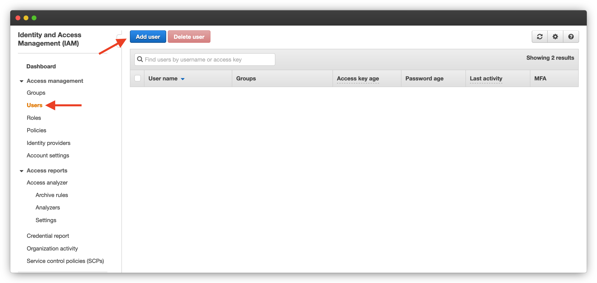
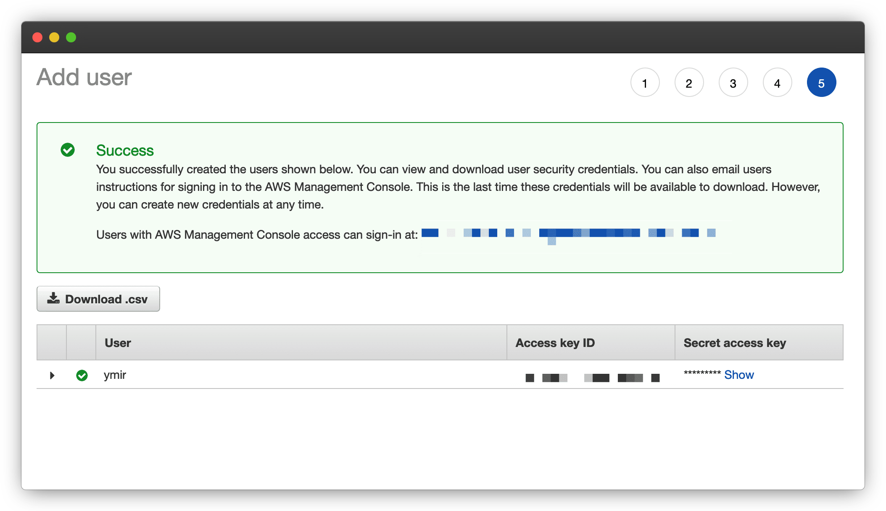

# Getting Started

## Supported AWS regions

Ymir requires AWS services that aren't available in all AWS regions. For that reason, only the following AWS regions are available at this time:

 * `ap-northeast-1` — Asia Pacific (Tokyo)
 * `ap-northeast-2` —  Asia Pacific (Seoul)
 * `ap-south-1` —  Asia Pacific (Mumbai)
 * `ap-southeast-1` —  Asia Pacific (Singapore)
 * `ap-southeast-2` —  Asia Pacific (Sydney)
 * `ca-central-1` —  Canada (Central)
 * `eu-central-1` —  EU (Frankfurt)
 * `eu-north-1` —  EU (Stockholm)
 * `eu-west-1` —  EU (Ireland)
 * `eu-west-2` —  EU (London)
 * `eu-west-3` —  EU (Paris)
 * `sa-east-1` —  South America (São Paulo)
 * `us-east-1` —  US East (N. Virginia)
 * `us-east-2` —  US East (Ohio),
 * `us-west-1` —  US West (N. California)
 * `us-west-2` —  US West (Oregon)

## Requirements

Ymir has the following requirements:

* [PHP 7.2 or higher][1]
* [Composer][2]

While WordPress still supports older versions of PHP, Ymir is a platform for modern PHP. The composer requirement is only for installing the Ymir CLI tool. Your WordPress project doesn't need to use composer for Ymir to deploy it.

While not a strict requirement, it's **highly** recommended to have [WP-CLI][7] installed. The Ymir CLI tool has advanced functionality available if WP-CLI is present on the local machine.

::: warning ext-zip required
The Ymir CLI needs PHP compiled with the zip extension. If Composer gives you an error about the extension missing, you'll need to reinstall PHP. If you're using a Mac, you can reinstall it using [Homebrew][8] using the procedure [here][9].
:::

## Installing the Ymir CLI

Most of your interactions with Ymir will be through the [Ymir CLI][3] tool. You cannot deploy your WordPress projects without it.

### Globally (preferred)

The preferred way to install the Ymir CLI is globally. You can use the following command to do so:

<pre class="language-bash">
<code>$ composer global require ymirapp/cli</code>
</pre>

::: warning Global vendor binaries directory
For the global installation to work, you must have the global vendor binaries directory in your `$PATH` environment variable. If you see the error `command not found: ymir`, this is the cause. You can add the global vendor binaries directory to your `$PATH` environment variable by following the procedure [here][10].
:::

After the installation, you can use the Ymir CLI like this:

<pre class="language-bash">
<code>$ ymir &lt;command&gt;</code>
</pre>

### Inside your project

You can also install the Ymir CLI in the specific projects that use Ymir. To do so, you just need run the following composer commmand:

<pre class="language-bash">
<code>$ composer require ymirapp/cli</code>
</pre>

When installed inside a project, you can find the Ymir CLI in the vendor binaries directory. To run a Ymir CLI command, you then write your commands like this:

<pre class="language-bash">
<code>$ vendor/bin/ymir &lt;command&gt;</code>
</pre>

## Creating an account

Before you begin to use Ymir, you're going to need an account on the platform. If you're just working on someone else's team, you don't need to have a paid Ymir subscription. It's only required for creating projects and managing resources on your own teams.

Speaking of teams, whenever someone creates an account on Ymir, a **Personal** team also gets created. You cannot delete this team, but you can rename it. That's because teams are central to Ymir. All your projects and resources are tied to a team.

## Connecting a team to AWS

In order to create resources and deploy projects, a team must be connected to at least one AWS account. You can do this with the `provider:connect` command or through the [team management][4] page. But before doing that, you'll need an AWS account to connect to.

### Creating an AWS account

If you don't already have an AWS account, you'll want to create one first. You can do this from the account creation page [here][5].

::: warning AWS costs not included
Your Ymir subscription doesn't include your AWS costs. So please ensure that you enter billing information when creating your AWS account.
:::

### Adding an IAM user

Connecting to an AWS account requires that you have an IAM user with programmatic access. It is preferable to create one especially for Ymir. You can do this through the [IAM console][6] or with the AWS CLI.

Using the AWS dashboard, you want to navigate to the IAM console. There, you'll want to click on **Users** on the left sidebar and then click on **Add user**. This will bring up the user creation wizard.

The first step of the wizard has you choose a username. Once that's done, you want to check **Programmatic access** checkbox in access type section below. Once you click **Next**, you'll be on the permissions screen.

There, you'll want to give administrator access to the user that you're creating. You do that by switching to the **Attach existing policies directly** tab. And from the list of policies that gets displayed, you select the **AdministratorAccess** policy.

After attaching the policy, you can skip to the end and create the user. You'll then be on the success screen where the the new user's credentials will be displayed. The **Access key ID** and **Secret access key** are the credentials you have to give to Ymir when connecting your AWS account.

[1]: https://php.net/releases/
[2]: https://getcomposer.org
[3]: https://github.com/ymirapp/cli
[4]: https://ymirapp.com/team/manage
[5]: https://portal.aws.amazon.com/billing/signup#/start
[6]: https://console.aws.amazon.com/iam/home
[7]: https://wp-cli.org/
[8]: https://brew.sh/
[9]: https://stackoverflow.com/questions/58290566/install-ext-zip-for-mac
[10]: https://stackoverflow.com/questions/25373188/how-to-place-the-composer-vendor-bin-directory-in-your-path
