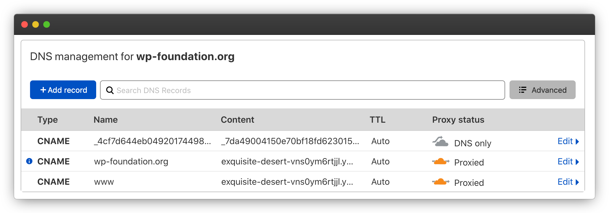

# Using Cloudflare as a content delivery network

[[toc]]

## Why use Cloudflare?

While Ymir already comes with CloudFront as a content delivery network, you're not required to use it if you don't want to. You can disable CloudFront using the [`cdn`][1] project configuration option. But you can also use another content delivery network like [Cloudflare][2].

Cloudflare is a popular content delivery network option because of its generous free tier. (CloudFront has no free tier.) It also has advanced features such as [Cloudflare workers][3], which CloudFront doesn't have.

## Prerequisites

To use Cloudflare as content delivery network, you need to have the following prerequisites met.

### Domain name

You must have a domain name you can use with Cloudflare to point to your Ymir project to. This domain will have to be managed by Cloudflare.

::: warning Cannot use vanity domain
You cannot use Cloudflare or other content delivery networks with the `ymirsites.com` vanity domain.
:::

### SSL certificate

Since you cannot have Ymir manage the domain used with Cloudflare, you must ensure to first create a SSL certificate for that domain using the `certificate:request` command.

::: warning Disable proxy
When adding your SSL certificate DNS validation record, make sure to disable the Cloudlfare proxy by setting it to `DNS only`.
:::

### SSL encryption mode

In Cloudflare, you must ensure to set the encryption level to `Full` for the domain that you'll use.


## Configuring your project

Now, we can start by changing our project configuration.

### Adding your domain

The main thing you need to do is to add the domain managed by Cloudflare as the domain for your project. For this guide, that domain will be `wp-foundation.org`. (It's just one of the many domains I own lol) Here's a partial `ymir.yml` project configuration file with the domain set for the `staging` environment:

```yml
environments:
  staging:
    domain: wp-foundation.org
```

### Content delivery network configuration

You can use Cloudflare with any `cdn` project setting. If you use it with `caching` set to `enabled`, Cloudflare will act as a content delivery network on top of CloudFront. If you set it to `assets`, you can have Cloudflare cache your pages while assets get served by CloudFront. Or if it's `disabled`, Cloudflare will cache your pages, but S3 will serve your your assets.

::: danger Cannot serve project assets with Cloudflare
It's currently not possible to serve your project assets due to how [customizing a S3 bucket domain name work][4].
:::

## Deploying your project

Next, you'll want to deploy your project. Once the project deployed, the Ymir CLI will display a warning with DNS records to add.


## Adding DNS records to Cloudflare

You'll then want to add these DNS records to Cloudflare like this:



[1]: ../reference/configuration.md#cdn
[2]: https://cloudflare.com
[3]: https://workers.cloudflare.com/
[4]: http://docs.aws.amazon.com/AmazonS3/latest/dev/VirtualHosting.html#VirtualHostingCustomURLs
