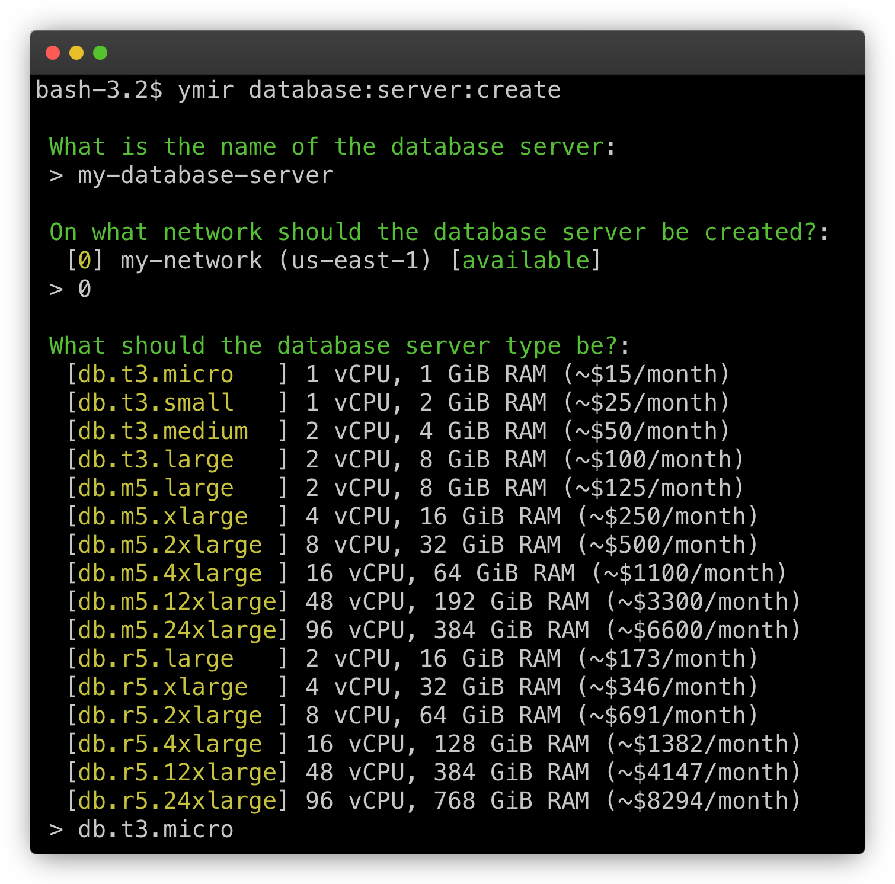
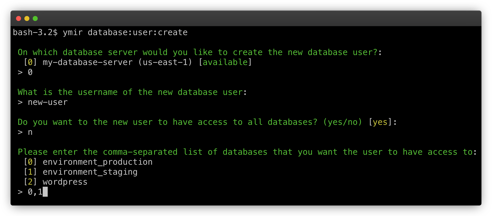
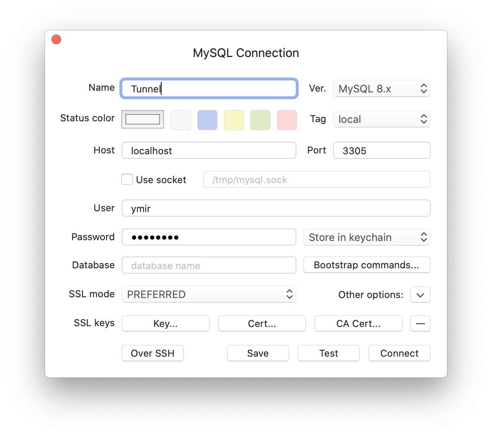

# Database servers

## Managing database servers

Before you can create a database, you'll need a database server. You can do this using the [`database:server:create`][1] command. The command will prompt you to fill in some details about the database server that you're creating.

::: tip Development database server
You can use the `--dev` option to create a development database server. The option will override all the database server options prompt and create a database server tailored for development.
:::

::: warning Can create a NAT gateway
Ymir will create a NAT gateway if you create a private database server and the network used by the database server doesn't have a NAT gateway already. A NAT gateway costs ~$32/month plus data transfer fees.
:::



Besides the network that the database server is on, all other details that you fill out are modifiable. You just need to use the [`database:server:modify`][2] command. You'll see the same prompt to change all the different settings of the database server.

::: warning Database unavailable during modification
Whenever you make a change to a database server, it'll become temporarily unavailable. The time that it takes for these modifications to take effect vary based on the size of the database.
:::

Deleting a database server is as simple as creating one. Just use the [`database:server:delete`][3] command. This will start the database server deletion process.

::: danger No recovery possible
If you delete a database server, it's gone forever. There's no way to restore it or cancel the deletion process.
:::

## Managing databases

By default, Ymir will create a `wordpress` database whenever it creates a database server. That said, since each WordPress site needs its own database, you'll probably need to create more. You can create databases using your favourite MySQL client.

That said, the Ymir CLI also has commands at your disposal to create databases without having to use another tool. The [`database:create`][4] and [`database:delete`][5] commands let you create and delete databases. You can also use the `database:list` command to see all the databases on a database server.

## Managing database users

Database users is another important aspect of database servers. By default, Ymir creates every database server with a `ymir` user as its [master user][6]. Ymir will only show the password for the `ymir` user once during the database server creation.

It's good security practice to not use the master user for any of your WordPress sites. This is why Ymir makes it easy to create additional users on your database servers. You can just use the [`database:user:create`][7] command to create one.



::: warning Do not give user full access
While Ymir offers the ability to give your user full access to your database server, this isn't recommended. Instead, you should only give the user access to the database(s) it needs. This is known as the [principle of least privilege][8].
:::

You can view all the users on a database server using the [`database:user:list`][9] command. The command will only show the users that Ymir created and manages. If you created some manually, they won't show up in the list.

You can also delete a user using the [`database:user:delete`][10] command. This command also only works for users managed by Ymir. If you want to delete a user that you created manually, you'll have to do it yourself.

## Using databases in a project

The magic of Ymir is how it ties all these database elements to your projects. In your `ymir.yml` configuration file, you can fill in all the database elements that we saw previously. Here's an example:

```yml
id: 1
name: project-name
type: wordpress
environments:
  staging:
    database:
      server: my-database-server
      name: environment_staging
      user: new-user
  production:
    database:
      server: my-database-server
      name: environment_production
      user: new-user
```

So our `ymir.yml` configuration file has two default environments: `staging` and `production`. Each environment has a `database` node. This is where you put all your database elements.

We have `server` where you put the name of the server. `name` is the database name. And `user` which is the database user. We're using all values that we saw previously.

Now when Ymir deploys your project, it'll convert these values into the proper environment variables. For the database user, it'll also inject its password for you. So no need to worry about that either!

## Connecting to a private database server

Because a private database server resides on your network's private subnet, it's not publicly accessible. To connect to it, you'll need to use the [`database:server:tunnel`][11] command. This command will create a [SSH tunnel][12] to your [bastion host][13] which allow you to connect to your database server.

Once the tunnel created, you can connect to the database server locally. Below is an example of how to connect using [TablePlus][14].



[1]: ../reference/ymir-cli.html#database-server-create
[2]: ../reference/ymir-cli.html#database-server-modify
[3]: ../reference/ymir-cli.html#database-server-delete
[4]: ../reference/ymir-cli.html#database-create
[5]: ../reference/ymir-cli.html#database-delete
[6]: https://docs.aws.amazon.com/AmazonRDS/latest/UserGuide/UsingWithRDS.MasterAccounts.html
[7]: ../reference/ymir-cli.html#database-user-create
[8]: https://en.wikipedia.org/wiki/Principle_of_least_privilege
[9]: ../reference/ymir-cli.html#database-user-list
[10]: ../reference/ymir-cli.html#database-user-delete
[11]: ../reference/ymir-cli.html#database-server-tunnel
[12]: https://en.wikipedia.org/wiki/Ssh_tunnel
[13]: ../team-resources/networks.html#bastion-host
[14]: https://tableplus.com
