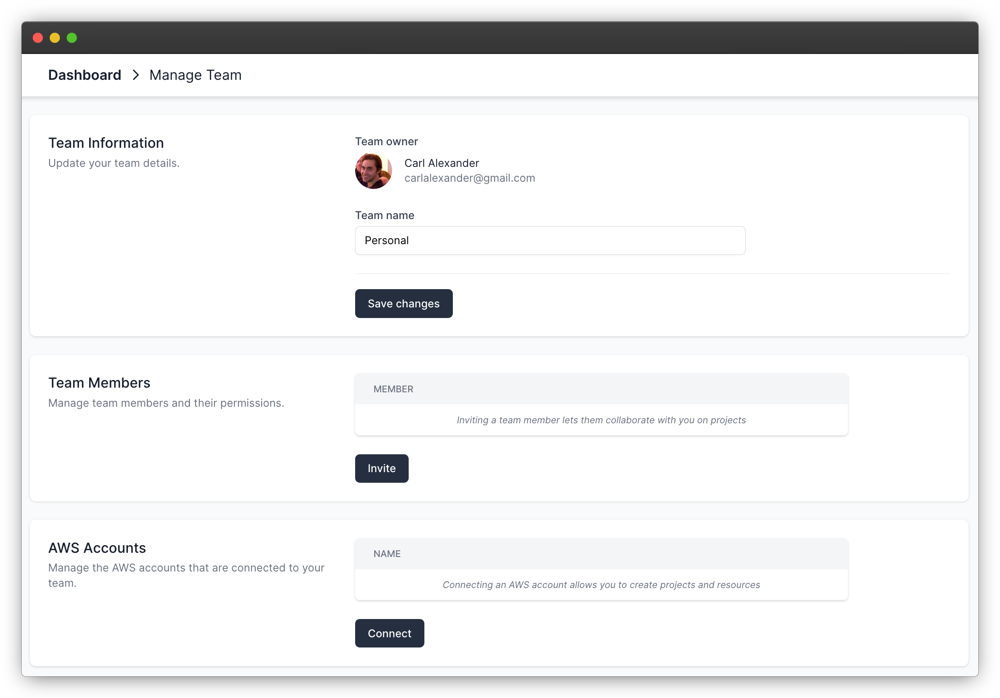
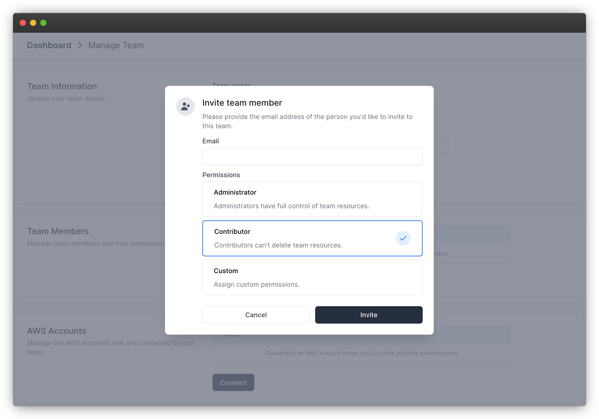
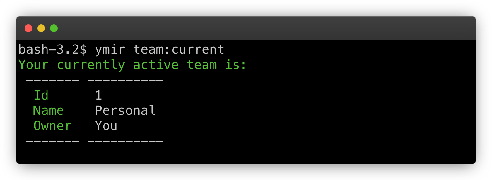

# Teams

Teams are the primary way to organize your projects with Ymir. You can have as many teams as you want with as many collaborators as you'd like. The person who created the team is the owner of that team.

::: warning Ymir subscription required for team owners
The team owner is the one who must have an active Ymir subscription for deployments and resource management to work. It isn't possible to move projects between teams or change team owners. So if you're working for an agency or a company, ensure that the person with the Ymir subscription is the one who creates the teams.
:::

## Creating a team

To create a team, you can either run the `team:create` command or go to the [dashboard][1] and create the team there. From the dashboard, you can also change the name of the team as well as perform other operations such as connecting AWS accounts.

## Inviting team members

Most of us don't work alone. We collaborate with others on projects. You can invite people to your team from the [team management][2] page or using the `team:member:invite` command.

::: tip No Ymir account required
You can invite anyone to your Ymir team. If they don't already have account, they just have to create one and then accept the team invitation.
:::

### Permissions

Whenever you invite someone to a team, you have to decide the permissions you want to give them. It can be overwhelming to know what permissions to give someone. So Ymir offers two permissions presets: **administrator** and **contributor**.

An **Administrator** has near full control of a team. They have a few limitations such as being unable to delete the team or invite team members. But outside of that, they are the same as a team owner.

A **Contributor** is someone who is an active participant on a team, but doesn't need to have full access to it. They can create projects, resources on AWS and so on. They just can't delete anything they create.

If you'd like to give a specific set of permissions to someone, you can choose the **Custom** option. This will bring up all the permissions you can give to someone. You can then pick the ones you want to assign to them.

[talk about command]

You can change someone's permissions at anytime. But you can only do it through the team management page.

## Your active team

While you can be on as many teams as you want, you can only have one team active at a time. Your active team will be where projects and resources get created. So it's important to always keep in mind what your active team is before creating them.

You can see your active when you visit the dashboard. You can also see it using the `team:current` command.

To switch teams, you can use the dropdown on the dashboard. Or you can use the `team:select` command to select a new active team.

## Removing a team member

Removing a team member works the same way as inviting someone. You can do this from the team management page. Or you can use the `team:member:remove` command.

[1]: https://ymirapp.com/dashboard
[2]: https://ymirapp.com/team/manage
